<!-- Typing: 4 lines, all glacier blue, typing simultaneously -->

 

<!-- Wave Divider -->
<svg width="600" height="30" xmlns="http://www.w3.org/2000/svg">
  <defs>
    <linearGradient id="waveG" x1="0" y1="0" x2="1" y2="0">
      <stop offset="0%" stop-color="#89CFF0"/><stop offset="100%" stop-color="#5DADE2"/>
    </linearGradient>
  </defs>
  <path d="M0 15 Q75 0 150 15 Q225 30 300 15 Q375 0 450 15 Q525 30 600 15" fill="none" stroke="url(#waveG)" stroke-width="1.5">
    <animateTransform attributeName="transform" type="translate" values="0,0;-12,0;0,0" dur="3s" repeatCount="indefinite"/>
  </path>
</svg>

<!-- Daily Joke (typing effect, no rollback) -->

<!-- JOKE_MARKER -->

 

<!-- Code Rain Strip -->
<svg width="600" height="35" xmlns="http://www.w3.org/2000/svg" style="display:block;">
  
  <text x="30" y="0" fill="#89CFF0" font-size="10" class="r d1">010</text>
  <text x="90" y="0" fill="#89CFF0" font-size="10" class="r d2">101</text>
  <text x="160" y="0" fill="#5DADE2" font-size="10" class="r d3">def</text>
  <text x="230" y="0" fill="#89CFF0" font-size="10" class="r d4">while</text>
  <text x="300" y="0" fill="#89CFF0" font-size="10" class="r d5">010</text>
  <text x="370" y="0" fill="#5DADE2" font-size="10" class="r d6">import</text>
  <text x="440" y="0" fill="#89CFF0" font-size="10" class="r d1">class</text>
  <text x="510" y="0" fill="#5DADE2" font-size="10" class="r d3">110</text>
  <text x="560" y="0" fill="#89CFF0" font-size="10" class="r d5">ret</text>
</svg>

 

<!-- Tech Stack -->

  
    
    
    
    
    
    
  

 

<!-- Snake Animation -->
<picture>
  <source media="(prefers-color-scheme: dark)" srcset="assets/snake-dark.svg" />
  <source media="(prefers-color-scheme: light)" srcset="assets/snake-light.svg" />
  
</picture>
