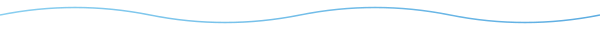

<!-- Header: glacier blue gradient typing with infinite loop -->

 

<!-- Daily Joke: per-character gradient typing, no rollback -->

 

<!-- Tech Stack -->

  
    
    
    
    
    
    
  

 

<!-- Wave Divider -->

 

<!-- Snake Animation (mint blue-green gradient) -->
<picture>
  <source media="(prefers-color-scheme: dark)" srcset="assets/snake-dark.svg" />
  <source media="(prefers-color-scheme: light)" srcset="assets/snake-light.svg" />
  
</picture>
